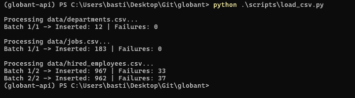
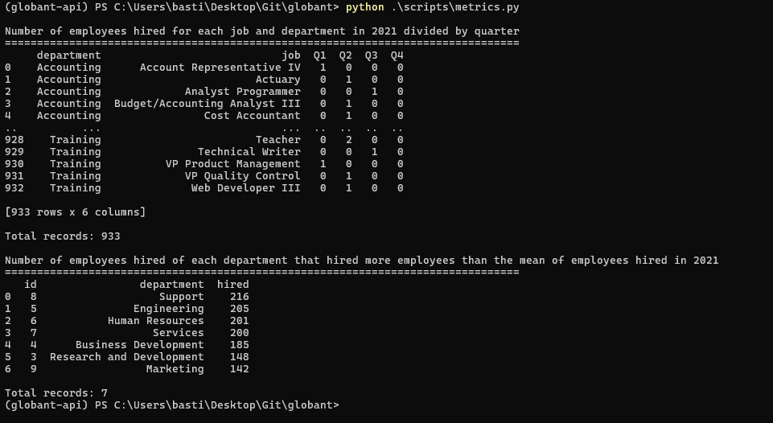

### Purpose

The `scripts/` directory provides standalone utilities for simulating client data ingestion and executing automated verification of the analytical endpoints.


### 1. load_csv.py
- **Functionality:** Reads historical CSV files from `data/`, partitions data into batches of up to 1,000 records, formats JSON payloads, and posts transactions to the API ingestion endpoints.
- **Data Preprocessing:** Replaces Pandas `NaN` values with `None` to enable JSON serialization and schema validation.
- **Execution Order:** Processes files in relational dependency order (`departments` -> `jobs` -> `hired_employees`) to satisfy foreign key requirements.
- **Usage:**
  ```powershell
  python scripts/load_csv.py
  ```

  Succesfully Run

  

---

### 2. test_metrics.py
- **Functionality:** Consumes the analytical SQL endpoints (`/api/v1/metrics/hires-by-quarter` and `/api/v1/metrics/departments-above-average`), loads results into Pandas DataFrames, and displays structured tabular outputs.
- **Validation:** Verifies that analytical queries execute and return aggregated data matching stakeholder specifications.
- **Usage:**
  ```powershell
  python scripts/test_metrics.py
  ```

  Succesfully Run
  
  