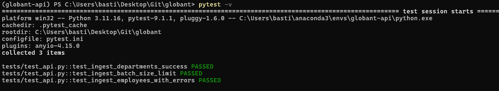

### Purpose

The `tests/` directory contains the automated testing suite utilizing `pytest` and `httpx` to validate API routing, schema compliance, and business logic without impacting the production database.

---

### Configuration Files
- **`conftest.py`:** Pytest configuration file. Intercepts the database dependency (`get_db`) and provisions a fresh, ephemeral SQLite in-memory database for each test execution. Injects the FastAPI `TestClient`.
- **`pytest.ini`:** Root configuration ensuring the `app` module is correctly resolved within the project's `PYTHONPATH`.

---

### Test Suites
- **`test_api.py`:** Main execution script containing test cases simulating client HTTP requests against the FastAPI application.

---

### Validation Scenarios
1. **Health Check:** Validates the root endpoint (`/`) responds with a 200 OK status.
2. **Successful Ingestion:** Verifies the `departments` batch endpoint successfully processes and counts valid JSON payloads.
3. **Payload Limit Rejection:** Asserts that Pydantic properly blocks and returns a `422 Unprocessable Entity` error for batch payloads exceeding 1,000 items.
4. **Error Isolation:** Confirms that payloads with missing fields (e.g., `name: null`) are accurately routed to the failed counter, while valid records in the exact same batch are successfully inserted.

  Succesfully Run

  

---